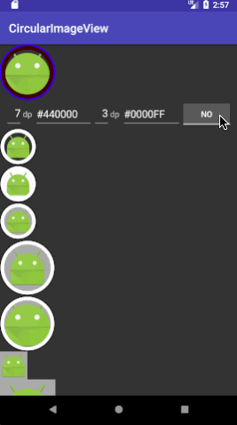

# CircularImageView

[  ](https://bintray.com/teachonmars/modules/CircularImageView/_latestVersion)

Another Circular ImageView widget that shows an image surrounded by a double ring, resulting in an image with a border and a gap between image and border.



## Downloads
use Gradle:

```gradle
repositories {
  jcenter()
}

dependencies {
    implementation 'com.teachonmars.modules:circularImageView:1.1.0'
}
```

Or Maven:

```xml
<dependency>
  <groupId>com.teachonmars.modules</groupId>
  <artifactId>circularImageView</artifactId>
  <version>1.1.0</version>
  <type>pom</type>
</dependency>

```

## Attributes

There are some customization allowed on this CIV to adapt it to your needs.
For both border and gap, you can :
- set a color (attrs borderColor & gapColor)
- set size (attrs borderSize & gapSize)

For image itself, you can :
- set attr needInsetDrawable to true to reduce image size to fit inside gap and border. If not, it crop image to fit inside outer border. (default is true)

Corresponding setter are also provided.

## How to use
### Xml

Just include the tag and parameters you need :

```xml
<com.teachonmars.modules.widget.circularImageView.CircularImageView
    android:layout_width="…"
    android:layout_height="…"
    android:src="…"
    app:needInsetDrawable="true|false" 
    app:borderColor="@color/borderColor"
    app:borderSize="@dimen/borderSize"
    app:gapColor="@color/gapColor"
    app:gapSize="@dimen/gapSize" />
```
### Java

There is a sample how to add it in java way :
```java
ViewGroup container = findViewById(R.id.container);
Context context=container.getContext();
 
CircularImageView civ = new CircularImageView(context);
civ.setBorderColor(Color.BLACK);
civ.setBorderSize(getResources().getDimensionPixelSize(R.dimen.borderSize));
civ.setGapColor(Color.BLUE);
civ.setGapSize(getResources().getDimensionPixelSize(R.dimen.gapSize));
civ.setNeedInsetDrawable(true);
civ.setImageDrawable(ContextCompat.getDrawable(context, R.mipmap.ic_launcher));
 
container.addView(civ);
```

### Default style
There is a default style applied to this view  : style.CircularImageViewDefault 

```xml
    <style name="CircularImageViewDefault">
        <item name="gapSize">6dp</item>
        <item name="gapColor">#FFF</item>
        <item name="borderSize">2dp</item>
        <item name="borderColor">#000</item>
        <item name="needInsetDrawable">true</item>
    </style>
```
